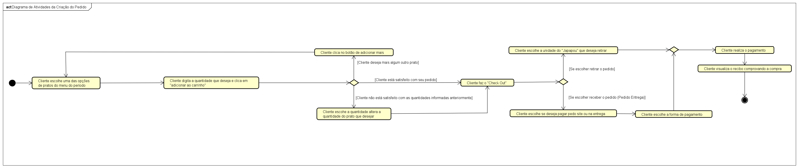
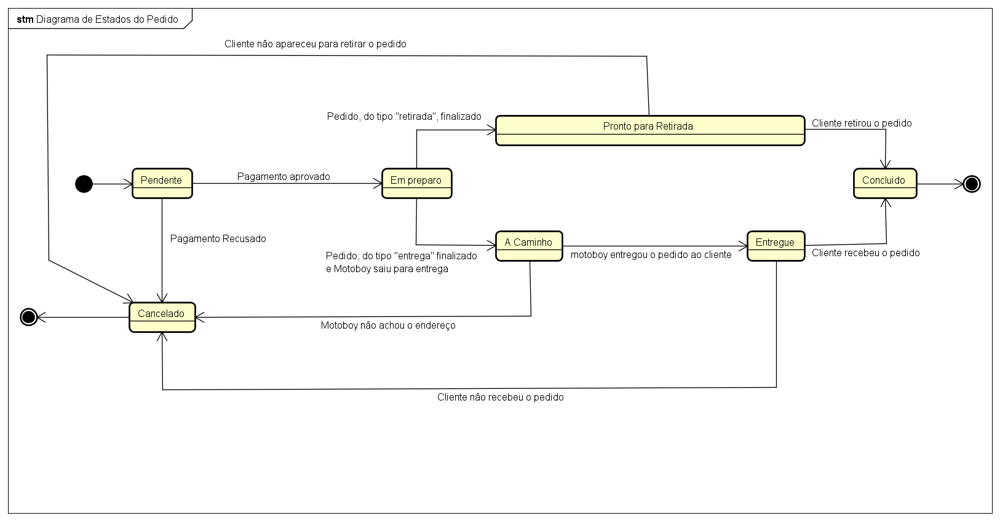

# Projeto Japapou

## Especificação do caso de uso - Fazer Pedido

### Histórico da Revisão

| Data       | Versão   | Descrição     | Autor           |
| :--------- | :------- | :------------ | :-------------- |
| 17/05/25 | **1.00** | Versão modelo | Juliana Beatriz |

### 1. Resumo

Este caso de uso permite o cliente faça pedidos de pratos presentes no menu do dia do restaurante.

### 2. Atores

-   Cliente

### 3. Pré-condições

São pré-condições para iniciar este caso de uso:

-   O cliente estar logado no sistema.

### 4. Pós-condições

Após a execução deste casos de uso, espera que o sistema:

-   Tenha os dados necessários para que o pedido seja finalizado e manejado.
-   Possibilite a edição dos dados fornecidos pelo cliente no pedido.

### 5. Fluxos de evento

#### 5.1. Fluxo Principal

| Ator | Sistema |
|:-------|:------- |
| 1. Na página de carinho, o cliente clica em "fazer pedido". | --- |
| --- | 2. O sistema faz o cálculo apenas dos pratos adicionados no carrinho. |
| 3. O cliente visualiza a página de dados do pedido e preenche-os. | --- |
| --- | 4. O sistema calcula o valor total do pedido através dos dados do pedido. |
| 5. O cliente clica em "confirmar pedido. | --- |

#### 5.2. Fluxo alternativo
Não há fluxo alternativo.

#### 5.3. Fluxo de excessão 
Não há excessão.

### 6. Prototipos de Interface

`A ser desenvolvido pela equipe.`

### 7. Diagrama de classe de domínio usados neste caso de uso

`A ser desenvolvido pela equipe.`

### 8. Diagrama de Atividades

### 9. Diagrama de Estados do Pedido

