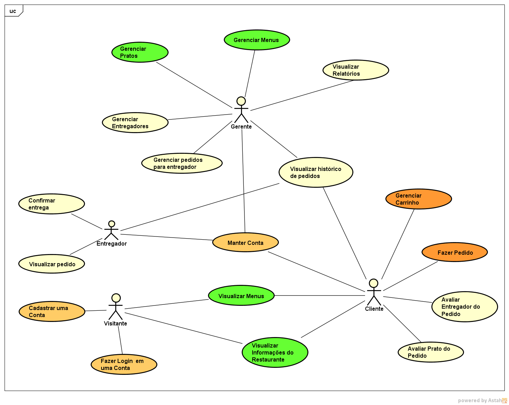

## 1. Diagrama de casos de uso 

## 2. Detalhamento dos casos de uso
1. [Visualizar carrinho (gerenciar carrinho)](./casos_de_uso/cdu_abrir_carrinho.md)
2. [Adicionar produtos no carrinho(gerenciar carrinho)](./casos_de_uso/cdu_adicionar_carrinho.md)
3. [Adicionar prato ao menu(gerenciar menu)](./casos_de_uso/cdu_adicionar_prato_menu.md)
4. [Confirmar entrega](./casos_de_uso/cdu_confirmar_entrega.md)
5. [Fazer pedido](./casos_de_uso/cdu_fazer_pedido.md)
6. [remove prato do menu(gerenciar menu)](./casos_de_uso/cdu_remover_prato_menu.md)